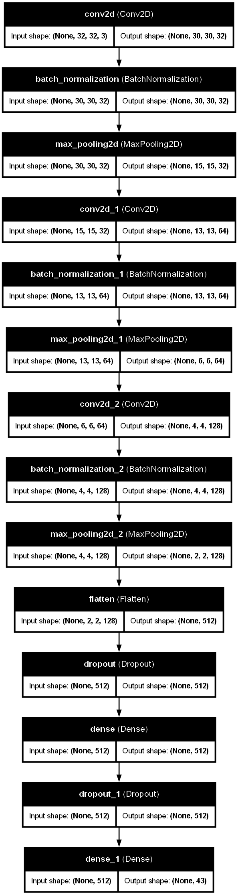

# Traffic Sign Recognition

A Deep Learning project that classifies traffic signs with high accuracy using a Convolutional Neural Network (CNN). The project includes a training pipeline, a visual evaluation dashboard and an interactive desktop application for real-time predictions.

## Preview


> **Note:** As seen in the preview above, the model is highly robust. It correctly identifies the traffic sign with high confidence, even when the input image is low-resolution, blurry, or pixelated.

## Features
* **Custom CNN Architecture:** Built using TensorFlow/Keras with Dropout and Batch Normalization.
* **Data Augmentation:** Robust training using image rotation, zoom, and shifts to handle real-world variations.
* **Interactive App:** A GUI-based application that allows users to upload any image from their computer for classification.
* **High Accuracy:** Optimized to achieve over 97% accuracy on the GTSRB dataset.

## Results
The model was trained for 15 epochs on the German Traffic Sign Recognition Benchmark (GTSRB).

| Metric | Score |
| :--- | :--- |
| **Training Accuracy** | 96.28% |
| **Validation Accuracy** | 99.57% |
| **Test Set Accuracy** | **97.00%** |

### Classification Insights
* **Top Performing Classes:** Stop signs (100%), Speed Limits, and Keep Left.
* **Challenging Classes:** Beware of Ice/Snow (Class 30) due to visual similarity with other triangular warning signs.

## Challenges and Solutions
* **Class Imbalance:** Some classes (like Speed limit 50) had 2000+ images while others (Speed limit 20) had fewer than 200.
    * *Solution:* Implemented on-the-fly Data Augmentation (rotation, zoom, shear) to artificially increase the variety of the minority classes during training.


## Installation & Usage

### 1. Setup
```bash
# Clone the repository
git clone [https://github.com/YourUsername/traffic-sign-recognition.git](https://github.com/YourUsername/traffic-sign-recognition.git)
cd traffic-sign-recognition

# Install dependencies
pip install -r requirements.txt
```

### 2. Run the App
To upload your own images and see the model in action:
```bash
python src/app.py
```

### 3. Training & Evaluation
If you want to retrain the model or check the test set metrics:
```bash
python src/train.py     
python src/evaluate.py  
```

## Project Structure

- data/: Dataset images and CSV labels (ignored by Git).

- models/: Saved .h5 model files (ignored by Git).

- notebooks/: Data exploration and visualization.

- src/: Source code for training, evaluation, and the app.

## Model Architecture

The following diagram illustrates the data flow through the Convolutional Neural Network. The model transitions from low-level feature extraction (edges and colors) to high-level pattern recognition (shapes and symbols).



### Architectural Design Choices
* **Batch Normalization:** Applied after each convolution to stabilize the learning process and significantly reduce training time.
* **Max Pooling:** Used to downsample feature maps, making the model robust to small changes in sign position and image noise.
* **Dropout (50%):** Strategically placed before the final layers to force the network to learn redundant representations, preventing the model from memorizing the training set.
* **Softmax Activation:** The final layer uses Softmax to provide a probability distribution across all 43 classes, allowing for a confidence-based prediction.